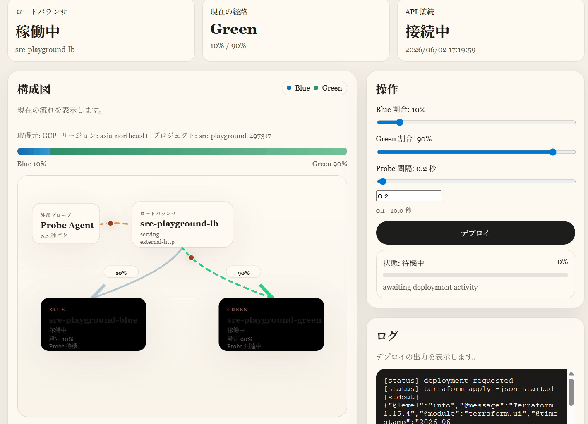

# SRE Playground

GCP 上に Blue/Green デプロイ環境を構築し、トラフィック制御・可観測性・リアルタイム可視化をワンストップで実装したポートフォリオです。



## このリポジトリでできること

| 機能 | 概要 |
|------|------|
| **Blue/Green デプロイ** | Cloud Run + Terraform でイメージをビルド・プッシュし、ロードバランサの重みを動的に切り替え |
| **トラフィック制御** | Blue/Green 間の重みをダッシュボードの UI から即時変更（Terraform 再適用） |
| **外部 Probe 監視** | Cloud Run 上の probe-agent がロードバランサへ定期 HTTP リクエストを送り、レイテンシ・エラー率を収集 |
| **OpenTelemetry トレース** | sample-app から OTel Collector → Tempo → Grafana までのトレースパイプラインを実装 |
| **可視化ダッシュボード** | Next.js 製ダッシュボードでデプロイ状況・メトリクスをリアルタイム表示。デモモードで読み取り専用公開も可能 |

## システム構成

```
[sample-app (Blue/Green)]
       ↓ トラフィック分散
  [GCP Load Balancer]
       ↓ probe
 [probe-agent (Cloud Run)]
       ↓ OTLP traces
[OTel Collector (Cloud Run)]
       ↓
 [Tempo] → [Grafana]
       ↓
[FastAPI] → [Next.js Dashboard]
```

## 技術スタック

- **インフラ**: GCP (Cloud Run, Load Balancer, Artifact Registry), Terraform
- **可観測性**: OpenTelemetry, Tempo, Grafana
- **バックエンド**: FastAPI (Python)
- **フロントエンド**: Next.js (TypeScript)
- **自動化**: Bash スクリプト群（セットアップ〜デプロイ〜切り替えまで一気通貫）

## ディレクトリ構成

```
apps/
  sample-app/      # Blue/Green デプロイ対象の Next.js アプリ
  api/             # FastAPI バックエンド（デプロイ制御・メトリクス集約）
  dashboard/       # Next.js 可視化ダッシュボード
  probe-agent/     # Cloud Run 上の外部 HTTP probe
infra/terraform/   # Cloud Run・LB の Terraform 定義
observability/     # OTel Collector・Grafana の設定
scripts/           # セットアップからデプロイ・切り替えまでの運用スクリプト
lib/               # 共通ライブラリ
```

## クイックスタート

### 前提

- `gcloud`（認証済み）/ `terraform` / `docker` / `python3` / `npm`

### 1. 環境変数の設定

```bash
cp .sre_playground.env.example .sre_playground.env
# PROJECT_ID, REGION などを編集
```

### 2. ローカル依存のセットアップ

```bash
./scripts/bootstrap_local.sh
./scripts/start_dashboard.sh
```

### 3. GCP 初期構築

```bash
./scripts/setup_gcp.sh
```

### 4. Blue/Green デプロイ

```bash
./scripts/deploy_blue_green.sh --blue-weight 100 --green-weight 0
```

### 5. トラフィック切り替え

```bash
./scripts/switch_traffic.sh --blue-weight 20 --green-weight 80
```

---

詳細な手順・オプションは以下を参照してください。

---

<details>
<summary>詳細手順（展開）</summary>

## 設定ファイル

毎回 `--project` を渡さなくて済むように、ルートの `.sre_playground.env` を読めるようにしています。
まず `.sre_playground.env.example` をコピーして使ってください。

```bash
cp .sre_playground.env.example .sre_playground.env
```

例:

```
PROJECT_ID="your-gcp-project-id"
REGION="asia-northeast1"
REPOSITORY_NAME="sre-playground"
SERVICE_NAME="sre-playground"
BLUE_TAG="blue"
GREEN_TAG="green"
PROBE_AGENT_SERVICE_NAME="sre-playground-probe-agent"
PROBE_AGENT_TAG="latest"
PROBE_AGENT_URL="https://<PROBE_AGENT_CLOUD_RUN_URL>"
PROBE_TARGET_URL="http://<LOAD_BALANCER_IP>"
PROBE_INTERVAL_SECONDS="5.0"
PROBE_TIMEOUT_SECONDS="5.0"
OTEL_COLLECTOR_SERVICE_NAME="sre-playground-otel-collector"
OTEL_COLLECTOR_TAG="latest"
OTEL_EXPORTER_OTLP_ENDPOINT=""
OTEL_EXPORTER_OTLP_TRACES_ENDPOINT=""
OTEL_ENVIRONMENT="demo"
GREEN_EXTRA_LATENCY_MS="400"
APP_ERROR_RATE="0.05"
DEMO_API_URL=""
DEMO_DASHBOARD_URL=""
```

優先順位は `CLI オプション > .sre_playground.env > スクリプト内デフォルト` です。

## scripts ディレクトリ

リポジトリ直下には運用スクリプトを置かず、すべて `scripts/` 配下に集約しています。

- `scripts/setup_gcp.sh`: GCP 初期セットアップ
- `scripts/bootstrap_local.sh`: ローカル依存の初期セットアップ
- `scripts/deploy_blue_green.sh`: Blue / Green イメージ build/push と Terraform apply
- `scripts/switch_traffic.sh`: 既存デプロイ済み環境のトラフィック切替
- `scripts/import_existing_infra.sh`: 既存 GCP リソースを Terraform state へ import
- `scripts/start_dashboard.sh` / `scripts/stop_dashboard.sh`: ダッシュボードの起動と停止
- `scripts/deploy_probe_agent.sh`: probe-agent の build / push / Cloud Run deploy
- `scripts/deploy_otel_collector.sh`: remote OTel Collector の build / push / Cloud Run deploy
- `scripts/deploy_demo_mode.sh`: frontend と API を Cloud Run へ demo mode で deploy
- `scripts/start_collector.sh` / `scripts/stop_collector.sh`: ローカル OTel Collector の起動と停止

## 1. ローカル初期構築

API、ダッシュボード、サンプルアプリの依存をまとめて入れるには次を実行します。

```bash
./scripts/bootstrap_local.sh
```

このスクリプトが行うこと:

- `apps/api/.venv` の作成
- FastAPI 依存のインストール
- `apps/probe-agent/.venv` の作成
- probe-agent 依存のインストール
- `apps/dashboard` の `npm install`
- `apps/sample-app` の `npm install`

起動例:

```bash
source apps/api/.venv/bin/activate
uvicorn app.main:app --reload --app-dir apps/api
```

```bash
NEXT_PUBLIC_API_BASE_URL=http://localhost:8000 npm --prefix apps/dashboard run dev
```

```bash
source apps/probe-agent/.venv/bin/activate
uvicorn app.main:app --reload --app-dir apps/probe-agent
```

または専用スクリプトを使います。

```bash
./scripts/start_dashboard.sh
```

このスクリプトは API と dashboard をデフォルトでバックグラウンド起動し、ログを `.run/api.log` / `.run/dashboard.log`、PID を `.run/api.pid` / `.run/dashboard.pid` に保存します。

API URL やポートを変える例:

```bash
./scripts/start_dashboard.sh --api-base-url http://localhost:8000 --api-port 8000 --port 3001
```

フォアグラウンドで起動したい場合:

```bash
./scripts/start_dashboard.sh --foreground
```

停止:

```bash
./scripts/stop_dashboard.sh
```

公開デモ向けの read-only 起動:

```bash
./scripts/start_dashboard.sh --demo-mode
```

`--demo-mode` では Deploy、traffic weight、probe interval の更新 UI は disabled になり、API も更新系 endpoint を `403` で閉じます。probe 間隔は `1.0s` に固定されます。

```bash
npm --prefix apps/sample-app run dev
```

## 2. GCP 初期構築

```bash
./scripts/setup_gcp.sh
```

設定ファイルを使わずに明示指定するなら:

```bash
./scripts/setup_gcp.sh --project <PROJECT_ID> --region asia-northeast1 --repository sre-playground
```

このスクリプトが行うこと:

- GCP プロジェクト確認
- 必要 API 有効化
- Artifact Registry 作成
- Docker 認証設定
- Terraform 実行用サービスアカウント作成
- 必要 IAM ロール付与
- `credentials/gcp-key.json` の生成

生成された鍵は自動では export しないので、必要なら次を設定してください。

```bash
export GOOGLE_APPLICATION_CREDENTIALS="$(pwd)/credentials/gcp-key.json"
```

## 3. 初回 Blue/Green デプロイ

Blue 100%、Green 0% で初回デプロイする例です。

```bash
./scripts/deploy_blue_green.sh --blue-weight 100 --green-weight 0
```

明示指定するなら:

```bash
./scripts/deploy_blue_green.sh \
  --project <PROJECT_ID> \
  --region asia-northeast1 \
  --repository sre-playground \
  --service-name sre-playground \
  --blue-weight 100 \
  --green-weight 0
```

このスクリプトが行うこと:

- `apps/sample-app` の Docker image を Blue / Green 用に build
- Artifact Registry へ push
- `gcloud auth configure-docker ${REGION}-docker.pkg.dev` の実行
- `infra/terraform` で `terraform init`
- 指定重みで `terraform apply`

主なオプション:

- `--skip-build`: build/push を飛ばして Terraform のみ実行
- `--blue-tag`: Blue イメージタグを変更
- `--green-tag`: Green イメージタグを変更

`Unauthenticated request` で push に失敗した場合:

1. `gcloud auth login`
2. `./scripts/setup_gcp.sh`
3. その後 `./scripts/deploy_blue_green.sh` を再実行

## 4. Probe-Agent デプロイ

LB への外部 probe 用サービスを Cloud Run にデプロイするには次を実行します。

```bash
./scripts/deploy_probe_agent.sh --target-url http://<LOAD_BALANCER_IP>
```

設定ファイルに `PROBE_TARGET_URL` があれば、`--target-url` は省略できます。

probe-agent API:

- `GET /health`
- `GET /settings`
- `POST /settings`
- `GET /latest`

## 5. Demo Mode デプロイ

frontend と API を GCP に demo mode で出すには次を実行します。

```bash
./scripts/deploy_demo_mode.sh
```

このスクリプトは次を行います。

- API を `DEMO_MODE=true` で Cloud Run deploy
- API の URL を使って dashboard image を build
- dashboard を Cloud Run deploy
- `.sre_playground.env` に `DEMO_API_URL` と `DEMO_DASHBOARD_URL` を書き戻す

## 6. O11y Phase 1

`apps/sample-app` には OpenTelemetry traces の土台を追加しています。OTLP HTTP exporter を環境変数で指定すると、sample app から collector へ trace を送れます。

主な環境変数:

- `OTEL_EXPORTER_OTLP_TRACES_ENDPOINT`
- `OTEL_EXPORTER_OTLP_ENDPOINT`
- `OTEL_ENVIRONMENT`
- `GREEN_EXTRA_LATENCY_MS`
- `APP_ERROR_RATE`

remote の collector を Cloud Run にデプロイするには次です。

```bash
./scripts/deploy_otel_collector.sh
```

collector のローカル起動:

```bash
./scripts/start_collector.sh
```

これで次が立ち上がります。

- OTel Collector: `localhost:4317` / `localhost:4318`
- Tempo: `http://localhost:3200`
- Grafana: `http://localhost:3300` (`admin` / `admin`)

例:

```bash
OTEL_EXPORTER_OTLP_TRACES_ENDPOINT=http://localhost:4318/v1/traces \
OTEL_ENVIRONMENT=demo \
GREEN_EXTRA_LATENCY_MS=400 \
APP_ERROR_RATE=0.05 \
npm --prefix apps/sample-app run dev
```

別ターミナルで sample app にリクエストを送ると、collector コンテナのログに trace が出ます。

```bash
curl http://localhost:3010/
docker compose -f observability/docker-compose.yml logs -f otel-collector
```

Grafana では `SRE Playground Trace Overview` ダッシュボードが provision 済みです。

停止:

```bash
./scripts/stop_collector.sh
```

## 7. Blue/Green 切替

既存イメージのままトラフィックだけ切り替える場合:

```bash
# Green に全面切替
./scripts/switch_traffic.sh --to green

# Blue に戻す
./scripts/switch_traffic.sh --to blue

# 段階切替
./scripts/switch_traffic.sh --blue-weight 20 --green-weight 80
```

別の設定ファイルを使いたい場合は `--config <FILE>` を渡せます。

```bash
./scripts/deploy_blue_green.sh --config ./envs/staging.env --blue-weight 100 --green-weight 0
```

Terraform state を失って `already exists` になる場合は、先に既存リソースを state へ取り込みます。

```bash
./scripts/import_existing_infra.sh --project <PROJECT_ID> --region asia-northeast1
```

## 8. 企画書との対応

- Phase 1: `infra/terraform` と `scripts/deploy_blue_green.sh`
- Phase 2: `apps/dashboard`
- Phase 3: `apps/api` と `scripts/switch_traffic.sh` / `scripts/deploy_blue_green.sh`

## 9. 補足

- FastAPI の `/api/deploy` はローカル検証用に mock deploy も返せます。
- 実 GCP デプロイでは Terraform Provider / GCP 側仕様差分で追加調整が必要になる可能性があります。
- HTTPS、独自ドメイン、Cloud Build 化、Terraform state のリモート管理は未実装です。

</details>
